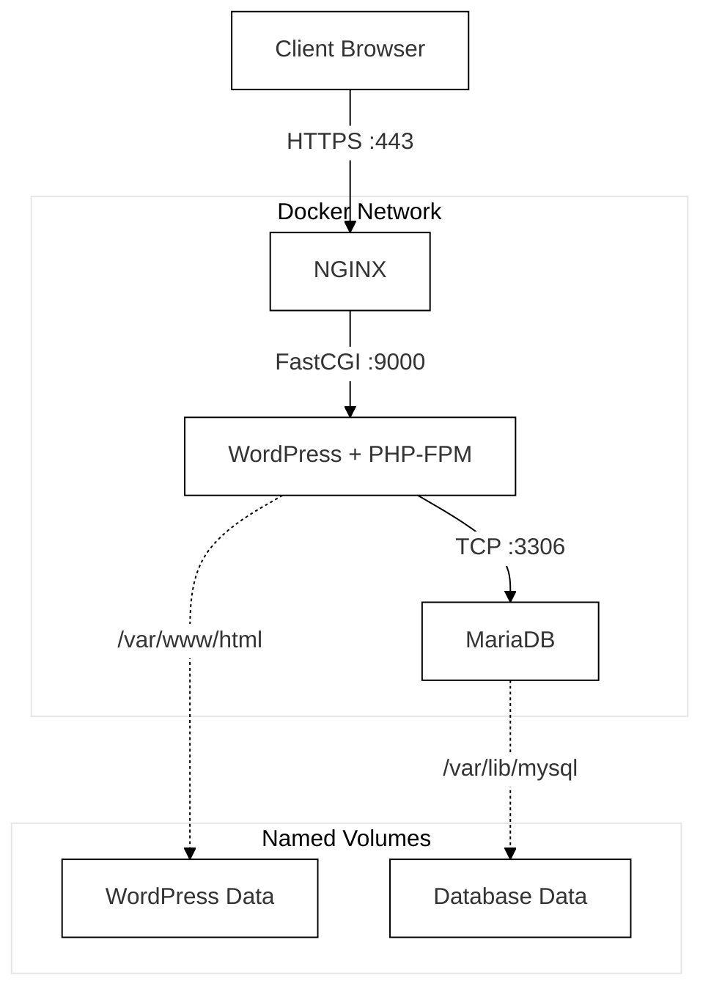

*This project has been created as part of the 42 curriculum by pmachado.*

# Inception

---

## Documentation Portal

Depending on your needs, please refer to the detailed documentation below:

*   **[What is this project?](#overview)** (Read on below for a high-level summary)
*   **[User Documentation](docs/USER_DOC.md):** Read this if you just want to **run and use** the application. It covers prerequisites, installation steps, accessing the site, and basic troubleshooting.
*   **[Developer Documentation](docs/DEV_DOC.md):** Read this if you want to understand the **technical implementation**. It covers the Dockerfile strategies, configuration choices, network design, and the `Makefile` structure.

---

## Overview

Inception is a System Administration project focused on setting up a small-scale, containerized web infrastructure using Docker.

The primary goal is to understand containerization and networking by building services **from scratch** rather than relying on pre-configured Docker images.
The project deploys a functional WordPress website using a multi-container architecture composed of:

-   **NGINX:** - The single public entry point, handling HTTPS (TLSv1.2 / TLSv1.3).
-   **WordPress + PHP-FPM:** - The application layer serving dynamic content.
-   **MariaDB:** - The database storing site data.
-   **Docker named volumes:** - Ensuring persistence of both database and website files.
-   **Private docker Network:** - Allowing internal communication between services.

The entire infrastructure runs inside a Linux virtual machine and only exposes port **443 (HTTPS)**.

## High-Level Architecture

This diagram illustrates how the services communicate and where persistent data is stored.


## Quick Start (TL;DR)

*For detailed instructions and prerequisites, please see the **[User Documentation](docs/USER_DOC.md)**.*

1.  **Prerequisites:** Ensure Docker, Docker Compose, and Make are installed in a Debian Bookworm VM.
2.  **Host Config:** Add the following line to your host's `/etc/hosts` file:
    `127.0.0.1 pmachado.42.fr`
3.  **Run:** Execute the following command at the project root:
    ```bash
    make up
    ```
    *(The first build might take a few minutes).*
4.  **Access:** Open `https://pmachado.42.fr` in your browser. A warning will be issued due to our self-signed certificate but you can safely proceed.

## Project Structure

```
.
├── Makefile # Main control script for building and running
├── README.md # This portal file
├── docs/
│   ├── DEV_DOC.md # Detailed technical explanations
│   └── USER_DOC.md # Usage instructions
└── srcs/
    ├── docker-compose.yml # Service orchestration
    ├── .env # Environment variables and secrets
    └── requirements/
        ├── mariadb/ # Database Dockerfile & tools
        ├── nginx/ # Web server Dockerfile & configs
        └── wordpress/ # Application Dockerfile & scripts
```