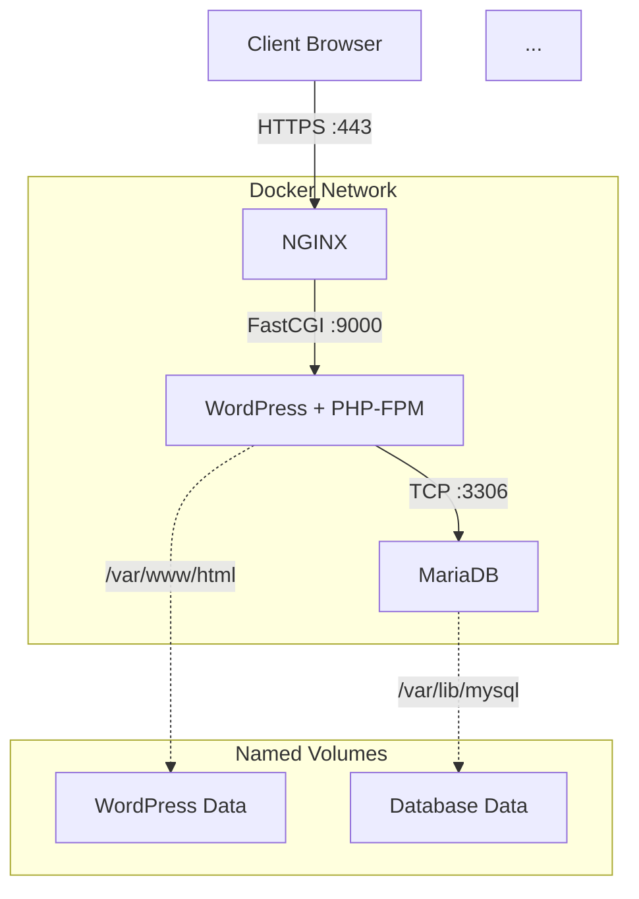

*This project has been created as part of the 42 curriculum by pmachado.*

# Inception

---

## Documentation Portal

Depending on your needs, please refer to the detailed documentation below:

*   **[What is this project?](#overview)** (Read on below for a high-level summary)
*   **[User Documentation](docs/USER_DOC.md):** Read this if you just want to **run and use** the application. It covers detailed prerequisites, installation steps, accessing the site, and basic troubleshooting.
*   **[Developer Documentation](docs/DEV_DOC.md):** Read this if you want to understand the **technical implementation**. It covers the Dockerfile strategies, configuration choices, network design, and the `Makefile` structure.

---

## Overview

Inception is a System Administration project focused on setting up a small-scale, containerized web infrastructure using Docker and Docker Compose.

The primary goal is to understand the specifics of containerization and networking by building services **from scratch** using custom Dockerfiles based strictly on **Debian Bookworm**, rather than relying on pre-configured "box" images.

The project deploys a secure WordPress website using a multi-container architecture composed of:

-   **NGINX:** The entry point acting as a reverse proxy, handling SSL termination and configured strictly for TLSv1.2 / TLSv1.3 protocols only.
-   **WordPress + PHP-FPM:** The application layer processing dynamic content.
-   **MariaDB:** The database layer storing site data.
-   **Docker Volumes:** Ensuring data persistence for the database and WordPress files across restarts.
-   **Docker Network:** A dedicated internal network allowing containers to communicate securely without being exposed to the host machine.

The entire infrastructure runs inside a Linux virtual machine and only exposes port **443 (HTTPS)** to the outside world.

## High-Level Architecture

The following diagram illustrates how the services communicate and where persistent data is stored.


## Quick Start (TL;DR)

*For detailed instructions and prerequisites, please see the **[User Documentation](docs/USER_DOC.md)**.*

1.  **Prerequisites:** Ensure Docker, Docker Compose, and Make are installed a Debian Bookworm VM.
2.  **Host Config:** Add the following line to your host's `/etc/hosts` file:
    `127.0.0.1 pmachado.42.fr`
3.  **Run:** Execute the following command at the project root:
    ```bash
    make up
    ```
    *(The first build will take several minutes).*
4.  **Access:** Open `https://pmachado.42.fr` in your browser. You must accept the security warning caused by the self-signed certificate.

## Project Structure

```
.
├── Makefile # Main control script for building and running
├── README.md # This portal file
├── docs/
│ ├── DEV_DOC.md # Detailed technical explanations
│ └── USER_DOC.md # Usage instructions
└── srcs/
├── docker-compose.yml # Service orchestration
├── .env # Environment variables and secrets
└── requirements/
├── mariadb/ # Database Dockerfile & tools
├── nginx/ # Web server Dockerfile & configs
└── wordpress/ # Application Dockerfile & scripts
```